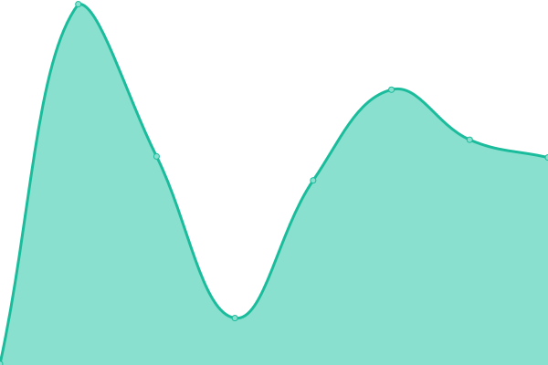
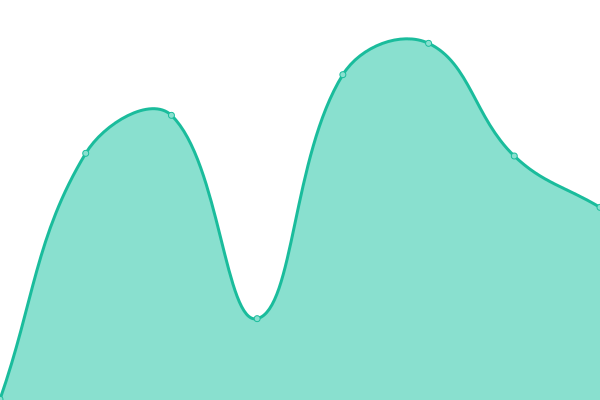

# [📈 Live Status](https://demo.upptime.js.org): <!--live status--> **🟧 Partial outage**

This repository contains the open-source uptime monitor and status page for [BitByBitConsulting](https://bitbybitconsulting.github.io/upptime/), powered by [Upptime](https://github.com/upptime/upptime).

With [Upptime](https://upptime.js.org), you can get your own unlimited and free uptime monitor and status page, powered entirely by a GitHub repository. We use [Issues](https://github.com/BitByBitConsulting/upptime/issues) as incident reports, [Actions](https://github.com/BitByBitConsulting/upptime/actions) as uptime monitors, and [Pages](https://bitbybitconsulting.github.io/) for the status page.

<!--start: status pages-->
<!-- This summary is generated by Upptime (https://github.com/upptime/upptime) -->
<!-- Do not edit this manually, your changes will be overwritten -->
<!-- prettier-ignore -->
| URL | Status | History | Response Time | Uptime |
| --- | ------ | ------- | ------------- | ------ |
|  [Google](https://www.google.com) | 🟩 Up | [google.yml](https://github.com/BitByBitConsulting/upptime/commits/HEAD/history/google.yml) | 

 95ms
     
 | 

<a href="https://upptime.bitbybit.consulting/history/google">100.00%</a>
    

|  [Wikipedia](https://en.wikipedia.org) | 🟩 Up | [wikipedia.yml](https://github.com/BitByBitConsulting/upptime/commits/HEAD/history/wikipedia.yml) | 

 185ms
     
 | 

<a href="https://upptime.bitbybit.consulting/history/wikipedia">100.00%</a>
    

|  [Hacker News](https://news.ycombinator.com) | 🟥 Down | [hacker-news.yml](https://github.com/BitByBitConsulting/upptime/commits/HEAD/history/hacker-news.yml) | 

 340ms
     
 | 

<a href="https://upptime.bitbybit.consulting/history/hacker-news">100.00%</a>
    

|  [BitByBit Support Relay](https://support.eblab.net/Bin/ConnectWiseControl.ClientSetup.exe?e=Access&y=Guest) | 🟥 Down | [bit-by-bit-support-relay.yml](https://github.com/BitByBitConsulting/upptime/commits/HEAD/history/bit-by-bit-support-relay.yml) | 

 549ms
     
 | 

<a href="https://upptime.bitbybit.consulting/history/bit-by-bit-support-relay">0.00%</a>
    

|  [BitByBit Website](https://bitbybit.consulting) | 🟩 Up | [bit-by-bit-website.yml](https://github.com/BitByBitConsulting/upptime/commits/HEAD/history/bit-by-bit-website.yml) | 

 189ms
     
 | 

<a href="https://upptime.bitbybit.consulting/history/bit-by-bit-website">100.00%</a>
    

|  [EONMSP Uptime Kuma](https://uptime.promarktech.co) | 🟥 Down | [eonmsp-uptime-kuma.yml](https://github.com/BitByBitConsulting/upptime/commits/HEAD/history/eonmsp-uptime-kuma.yml) | 

 87ms
     
 | 

<a href="https://upptime.bitbybit.consulting/history/eonmsp-uptime-kuma">100.00%</a>
    

<!--end: status pages-->

[**Visit our status website →**](https://bitbybitconsulting.github.io/upptime/)

## 📄 License

- Powered by: [Upptime](https://github.com/upptime/upptime)
- Code: [MIT](./LICENSE) © [Anand Chowdhary](https://anandchowdhary.com), supported by [Pabio](https://pabio.com)
- Data in the `./history` directory: [Open Database License](https://opendatacommons.org/licenses/odbl/1-0/)
